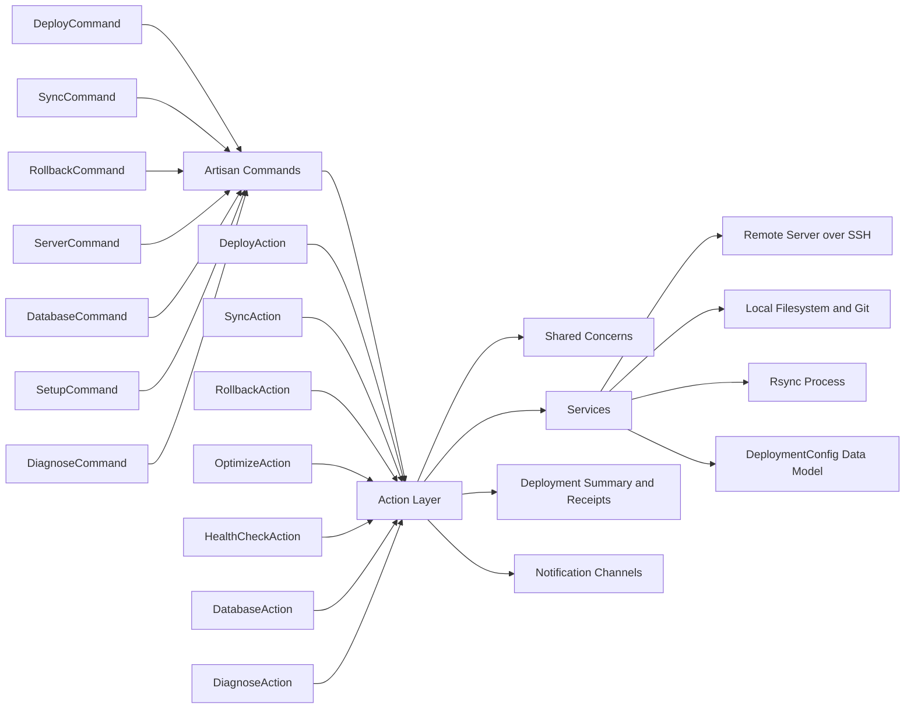
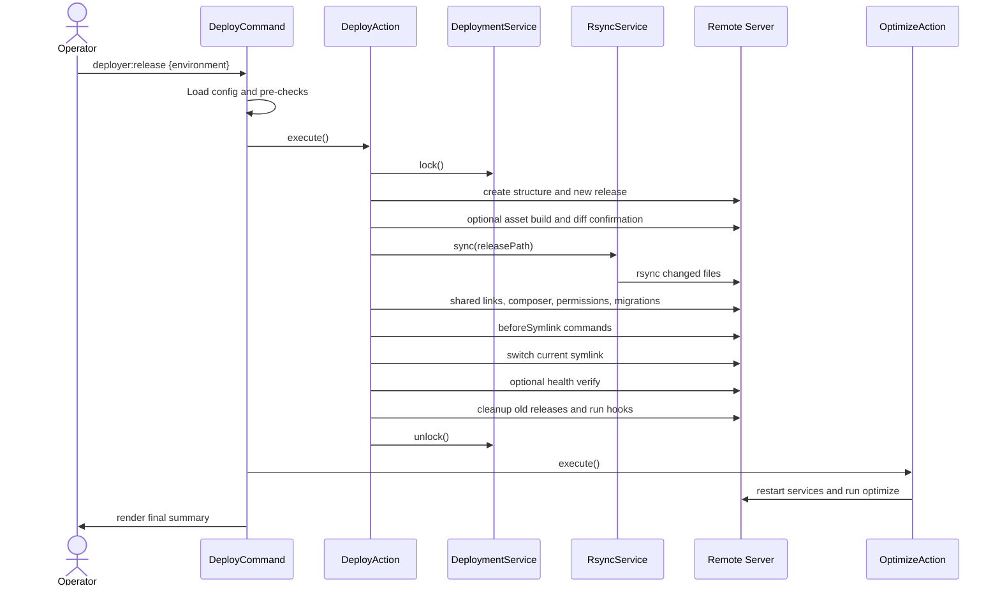
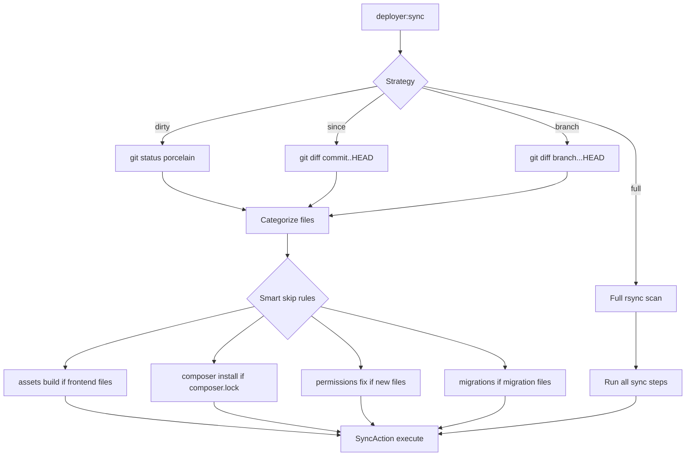

# Laravel Deployer: Repository Overview

Generated on: 2026-02-24

This document summarizes the current codebase from three perspectives:
- Software Architect
- Software Developer
- Product Manager

It is based on a full repository walkthrough of `src/`, `tests/`, `scripts/`, `stubs/`, and existing docs.

## Executive Summary

The package is a command-driven Laravel deployment framework focused on zero-downtime releases, rsync-based sync, rollback, diagnostics, database utilities, and server provisioning.

Core strengths:
- Clear layering: commands -> actions -> services -> data objects
- Strong operational focus: locking, release history, health checks, receipts, diagnostics
- Good performance choices: SSH multiplexing, batched remote commands, copy-previous-release strategy, sync-only mode

Key opportunities:
- Several code/doc/schema mismatches can confuse users and create production risk
- Some configuration options appear wired in data models but not honored at runtime
- A few high-severity runtime and UX consistency issues should be prioritized

## Repository Snapshot

- PHP source size: `13,557` lines in `src/`
- Test size: `3,367` lines in `tests/`
- Source modules:
  - `src/Commands`: 11 files
  - `src/Actions`: 10 files
  - `src/Services`: 10 files
  - `src/Data`: 10 files
  - `src/Support`: 4 files
  - `src/Concerns`: 4 files
- Testing style: Pest + Testbench
- Packaging: Laravel package (`composer` type `library`)

## 1) Software Architect Perspective

### 1.1 Architectural Style

The architecture is orchestration-centric:
- Commands are entry points and UX controllers.
- Actions represent business workflows (deploy, sync, rollback, optimize, diagnose, DB ops).
- Services encapsulate infrastructure concerns (SSH, rsync, config loading, git diff, receipts, hooks).
- Data classes carry immutable-ish runtime config and execution artifacts.

This is a pragmatic architecture for CLI operations: low abstraction overhead, easy debugging, and clear execution flow.

### 1.2 Component Model

### 1.3 Full Deploy Runtime Flow

### 1.4 Scalability and Reliability Characteristics

What scales well:
- SSH multiplexing to reduce connection overhead
- Rsync incremental transfer and optional git-based file narrowing
- Sync-only mode for small hotfixes
- Locking to prevent concurrent deploy collisions
- Release retention and rollback model

Operational resilience features:
- Automatic lock/unlock in `try/finally`
- Health verification support
- Deployment receipts and diagnostic tooling
- Warning system for redundant cache/optimize command setups

### 1.5 Architecture Risks and Priority Recommendations

1. P0: Health check exception mismatch can trigger fatal path under high disk usage.
- Evidence: `HealthCheckAction` calls `HealthCheckException::diskSpaceLow(...)` while exception class defines `diskSpaceCritical(...)`.
- Recommendation: align method names and add regression tests for critical disk branch.

2. P0: Runtime rsync behavior ignores configured rsync flags/options.
- Evidence: `DeploymentConfig` has `rsyncFlags/rsyncOptions`, but `RsyncService` uses `Constants\Commands::RSYNC_FLAGS/RSYNC_OPTIONS`.
- Recommendation: make `RsyncService` consume config values first, constants as fallback.

3. P1: Environment scalability is constrained by hardcoded allowed values in deploy/sync commands.
- Evidence: Deploy and Sync command validate against only `local/staging/production`.
- Recommendation: validate against environments declared in `.deploy/deploy.json` via `ConfigService`.

4. P1: Security intent is partially bypassed in remote diff.
- Evidence: `DiffAction` remote rsync uses `StrictHostKeyChecking=no` regardless of config.
- Recommendation: respect `strictHostKeyChecking` setting consistently across all SSH paths.

5. P1: Schema and runtime model drift increases integration risk.
- Evidence: schema documents nested `healthCheck` object while runtime mainly reads `healthCheckUrl`; runtime supports `rsync.useGitignore` and `assets.verify` but schema coverage is inconsistent.
- Recommendation: generate schema from runtime model or add schema contract tests.

6. P2: Duplicate/overlapping abstractions suggest architectural drift.
- Examples: `SelectsServer` vs `ManagesServerSelection`, `ManagesLocalBackups` vs `BackupManager` flows.
- Recommendation: consolidate on one trait/service path per concern.

## 2) Software Developer Perspective

### 2.1 Code Structure and Implementation Quality

Strengths:
- Workflows are readable and explicit.
- `DeployAction` and `SyncAction` share behavior through `ManagesDeploymentSteps`, reducing duplication.
- `DeploymentConfig` uses a useful `with()` pattern for immutable-style overrides.
- Error and warning messaging is generally operator-friendly.

Maintainability concerns:
- Some very large command classes (`SetupCommand`, `ServerCommand`) bundle UI, validation, process execution, and domain orchestration.
- Several command examples/messages appear stale compared to actual command signatures.
- Interactive mode collects options (`buildAssets`, `runMigrations`, `clearCaches`) that are not fully applied in `DeployCommand`.

### 2.2 Developer Experience and Test Posture

Test strengths:
- Healthy set of unit tests around key primitives (config merge, rsync parsing, hooks, step timer, enums, sync strategy/categories).
- Feature tests exist for core actions and command registration.

Test gaps:
- Complex high-risk flows in `SetupCommand` and `ServerCommand` are lightly tested.
- Contract mismatch risks (schema vs runtime, docs vs command signatures) are not guarded by tests.
- Limited end-to-end test coverage for real command path combinations (interactive + optimize + postDeploy + sync strategies).

### 2.3 Developer-Facing Action Items

1. Add contract tests for:
- command signatures vs README examples
- schema properties vs `DeploymentConfig::fromArray()`

2. Refactor large command classes:
- extract provisioning orchestration from `ServerCommand`
- extract migration phases from `SetupCommand` into dedicated services/actions

3. Align interactive mode behavior:
- either wire all prompted options into execution paths or remove prompts that are currently no-op

4. Harden package portability:
- avoid hard dependency on `App\Models\User` inside package command flow (or gate behind explicit feature flag)

### 2.4 Sync Decision Logic

## 3) Product Manager Perspective

### 3.1 Product Positioning and Value

Primary product value:
- Give Laravel teams a repeatable deployment operator toolkit with low downtime and fast feedback.

Core jobs-to-be-done:
- Ship a new release safely.
- Push a small hotfix fast.
- Recover quickly from a bad release.
- Diagnose environment permission/config drift.
- Manage backup/restore and initial server provisioning.

### 3.2 Feature Coverage by User Journey

Journey: Initial adoption
- `deployer:setup install`
- `.deploy/deploy.json` + environment secret files

Journey: Standard release
- `deployer:release`
- preflight, diff, sync, migrations, symlink switch, optimize, summary

Journey: Fast hotfix
- `deployer:sync` with `--dirty`, `--since`, or `--branch`

Journey: Recovery
- `deployer:rollback`

Journey: Operations and maintenance
- `deployer:server clear`
- `deployer:server diagnose`
- receipts and diagnostic command

Journey: Data operations
- `deployer:db backup|download|upload|restore|list`

Journey: Infra bootstrap
- `deployer:server provision` plus script components

### 3.3 Usability and Adoption Friction

High-friction items:
- Documentation command examples do not consistently match current command signatures.
- README still references deprecated/removed patterns (for example: `deployer staging`, `--sync-only`, `deployer:release rollback ...`).
- Setup command output also shows outdated command examples.

Potential trust issues for operators:
- Prompted interactive options that are not all honored can feel misleading.
- Schema/runtime drift can make IDE-assisted config editing unreliable.

### 3.4 Product Roadmap Suggestions

Now:
1. Fix critical runtime mismatches (health check exception, rsync config application).
2. Update docs and in-command help text to match actual commands.
3. Add regression tests for command/docs/schema contracts.

Next:
1. Support arbitrary environment names consistently across all commands.
2. Unify backup/server selection APIs and remove duplicate trait paths.
3. Improve package portability by removing app-specific assumptions in DB command flows.

Later:
1. Introduce optional telemetry/metrics output for deployment trends.
2. Add policy profiles (strict production, fast staging, local-safe).
3. Consider plugin architecture for project-specific behavior (asset build command variants, framework-specific optimize hooks).

## Actionable Questions for the Team

1. Should command UX prioritize backward compatibility aliases (`deployer staging`) or enforce explicit namespaced commands only?
2. Do you want schema to be the source of truth (generate PHP config model), or model to be source of truth (generate schema)?
3. Should environment names be fully dynamic from config everywhere, including deploy/sync validation?
4. Do you want interactive mode to remain broad (many toggles), or become minimal and only expose options that currently work end-to-end?
5. For multi-project support, should project-specific behavior (for example `npm run prod` vs `npm run build`) be first-class config instead of conventions/hooks?
6. Should diagnostics evolve into an automated pre-deploy gate in CI for production environments?

## Suggested 30-Day Improvement Backlog

1. Stabilize contracts and docs
- Align README and command examples with current signatures.
- Align JSON schema with `DeploymentConfig` behavior.

2. Fix correctness issues
- Repair health check exception mismatch.
- Make rsync honor per-environment flags/options from config.
- Make remote diff honor strict host key policy.

3. Improve maintainability
- Split `SetupCommand` and `ServerCommand` into smaller orchestration units.
- Consolidate duplicate traits/services for server and backup selection.

4. Improve confidence
- Add end-to-end tests for deploy/sync/rollback command combinations.
- Add smoke tests for docs examples and schema consistency.

## Appendix: Notable Files for Orientation

- Entry points:
  - `src/LaravelDeployerServiceProvider.php`
  - `src/Commands/*.php`

- Core orchestration:
  - `src/Actions/DeployAction.php`
  - `src/Actions/SyncAction.php`
  - `src/Concerns/ManagesDeploymentSteps.php`

- Infrastructure services:
  - `src/Services/CommandService.php`
  - `src/Services/DeploymentService.php`
  - `src/Services/RsyncService.php`
  - `src/Services/ConfigService.php`

- Observability and diagnostics:
  - `src/Services/ReceiptService.php`
  - `src/Actions/DiagnoseAction.php`
  - `src/Commands/DiagnoseCommand.php`

- Provisioning scripts:
  - `scripts/provision.sh`
  - `scripts/components/*.sh`

- Configuration contracts:
  - `stubs/deploy.json`
  - `stubs/deploy.schema.json`

- Test suite:
  - `tests/Unit/*.php`
  - `tests/Feature/*.php`
